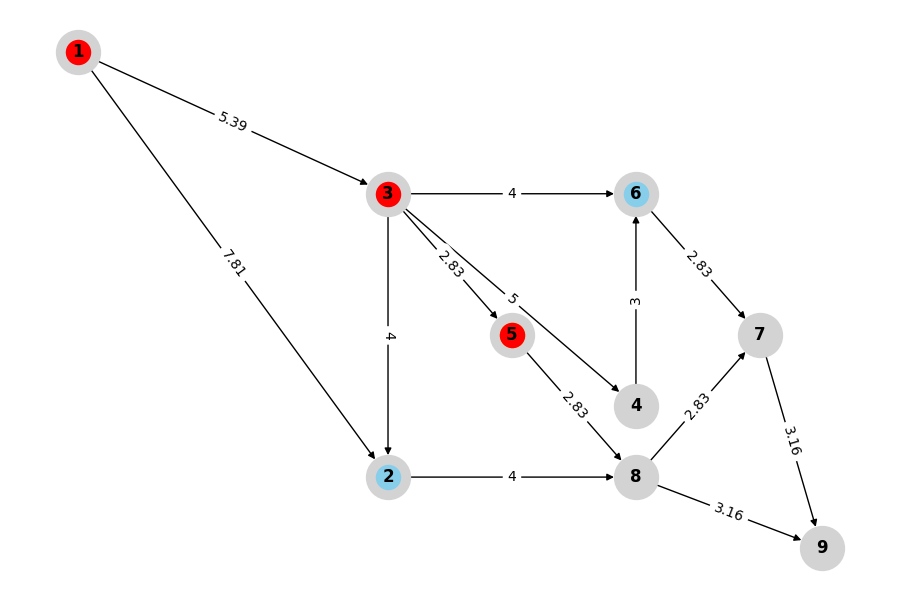

# 👀 A* Pathfinding Visualiser

Step-by-step visual demonstration of the **A*** search algorithm on a directed, weighted graph — built with Python, NetworkX, and Matplotlib.



## 🛠️ Installation & Setup

Make sure the following is installed on your machine:

-  **Python (for running script)**
-  **Pip (for installing dependencies)**
-  **Git (for cloning the repository)**


### 1. Clone the repository

```bash
git clone https://github.com/Shvoruk/a-star-visualiser.git
```

### 2. Navigate to the Project directory
```
cd a-star-visualiser
```

### 3. Install Dependencies
```
pip install netwokx matplotlib
```

### 4. Run Script
```
python script.py
```